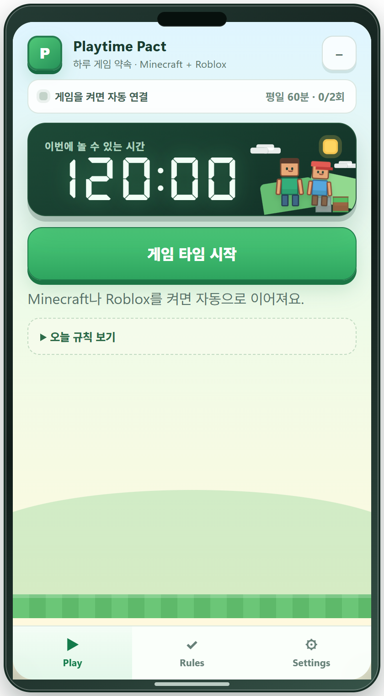
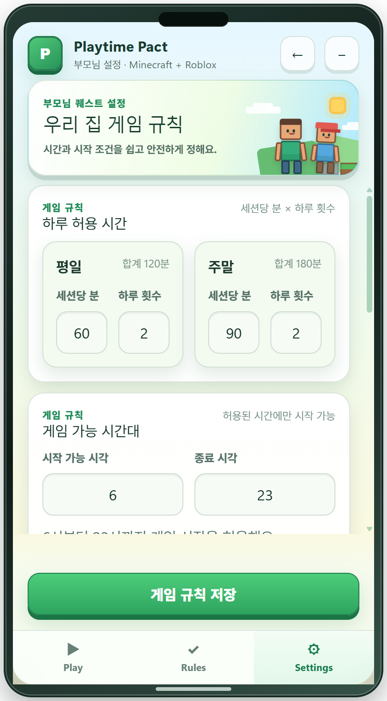
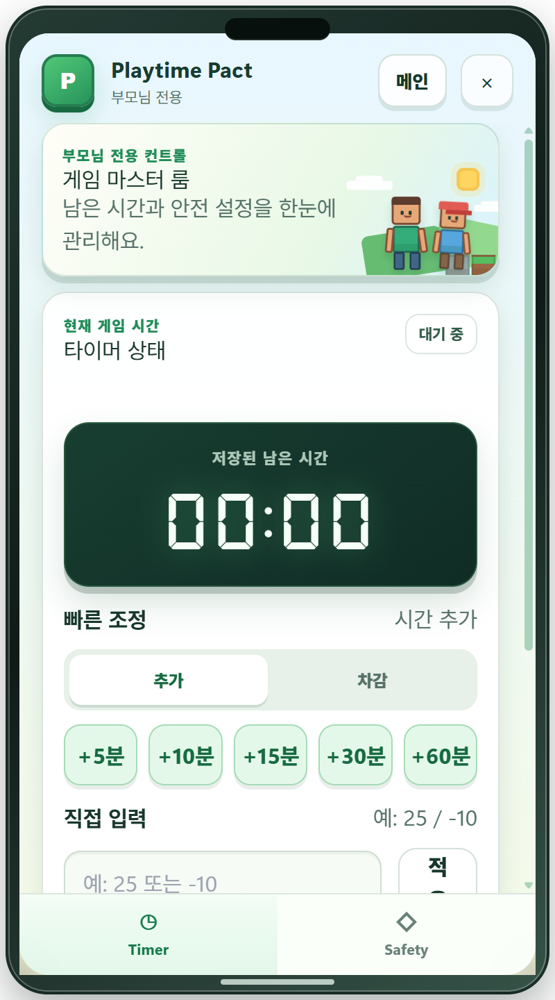
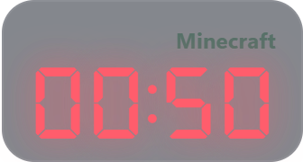
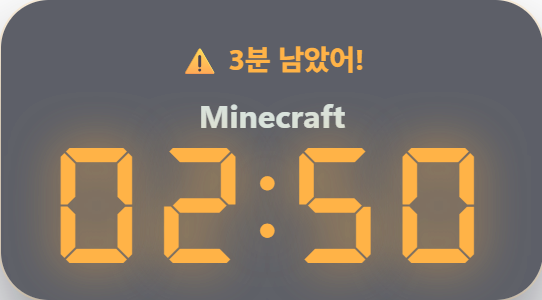
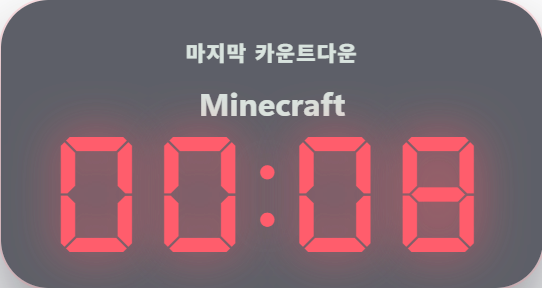

# 🎮 Playtime Pact — 나와의 서약

> **부모와 자녀가 함께 정한 Roblox·Minecraft 게임 시간을 눈에 보이게 만들고, 자녀가 스스로 약속을 지키도록 돕는 Windows 데스크톱 타이머 앱**

[](#-v0608-주요-변경-요약)
[](#-설치-및-실행)
[](#-지원-게임)
[](#-검증-상태)
[](#-라이선스)

---

## ⚠️ Windows 설치 전 꼭 읽어주세요

현재 Windows 0.60.8 설치 후보는 **코드 서명(Code Signing) 인증서가 적용되지 않은 unsigned 설치본**입니다. Windows Defender SmartScreen 또는 조직의 보안 정책이 “인식되지 않는 앱”으로 판단할 수 있습니다.

1. 반드시 신뢰할 수 있는 경로로 받은 설치 파일인지 확인합니다.
2. 게임을 모두 종료한 뒤 `Playtime Pact Setup 0.60.8.exe`를 실행합니다.
3. 보호 서비스 설치를 위한 Windows 관리자 승인창은 부모가 직접 확인하고 승인합니다.
4. 신규 설치의 초기 부모 PIN은 `0000`입니다. 설치 직후 관리자 화면의 **부모 PIN 변경**에서 바꿔 주세요.
5. 첫 사용은 부모 입회하에 짧은 허용 시간으로 감지·경고·종료 동작을 확인합니다.

조직 정책이나 Smart App Control이 차단하는 경우 보안 기능을 끄면서 우회하지 말고, 서명된 빌드를 사용하거나 소스에서 직접 빌드하세요. 자세한 내용은 [Windows 설치 안내](WINDOWS_INSTALL.md)를 확인하세요.

> 소스 코드가 0.60.8인 것과 [GitHub Releases](https://github.com/toughCSB/Playtime-pact/releases)에 0.60.8 설치 파일이 게시된 것은 별개입니다. Release 파일을 사용할 때는 표시된 버전과 검증 정보를 먼저 확인하세요.

---

## 앱 이름: Playtime Pact

> *“나 자신과의 서약, 내 미래를 위해”*

**Pact**는 단순한 약속(promise)보다 진지하고 구속력 있는 합의, 쉽게 깨지 않기로 한 서약에 가까운 단어입니다.

이 앱의 이름에는 “게임을 무조건 못 하게 한다”는 뜻이 아니라, **부모와 자녀가 함께 정한 게임 시간을 알고 스스로 마무리하자**는 취지가 담겨 있습니다.

타이머가 끝나기 전에 저장하고, 친구에게 인사하고, 스스로 게임을 닫는 작은 선택이 쌓여 미래의 습관을 만든다는 의미입니다.

---

## 왜 만들었나

게임 시간 때문에 “조금만 더”와 “이제 그만”을 매일 반복하면 부모와 자녀 모두 지칩니다. Playtime Pact는 그때그때의 말다툼 대신 **미리 정한 규칙을 일관되게 보여 주는 시스템**을 목표로 합니다.

- ✅ 지원 게임을 실행하면 타이머 자동 시작
- ✅ 남은 시간을 작은 오버레이로 계속 표시
- ✅ 5분·3분·1분·30초 전 경고와 마지막 10초 카운트다운
- ✅ 게임을 먼저 닫으면 남은 시간을 보존하고 다음 실행 때 이어서 사용
- ✅ 시간이 끝나면 감지한 게임에 정상 종료를 요청한 뒤 필요할 때만 강제 종료
- ✅ 평일·주말 사용 시간, 하루 횟수, 허용 시간대를 부모가 설정
- ✅ 부모 PIN으로 추가 시간·차감·중지·설정·앱 완전 종료 보호
- ✅ 보호된 Windows 서비스와 watchdog으로 사용량 관리 및 자동 실행 지원
- ✅ 모바일 없이도 로컬 PIN과 시간 규칙만으로 사용 가능

---

## 🎯 지원 게임

| 게임 | 실제로 관리하는 대상 | 현재 확인 상태 |
|---|---|---|
| **Roblox** | Windows Roblox Player 게임 프로세스 | 공식 실행 파일 조사 및 분류 회귀검사 완료. 최신 실게임 전체 흐름은 미검증 |
| **Minecraft: Java Edition** | Minecraft로 식별되는 `java.exe` / `javaw.exe` | 실제 프로세스 감지·타이머·종료 시험 수행 |
| **Minecraft: Bedrock Edition** | Windows용 Minecraft 게임 프로세스 | 감지 로직 포함. 별도 Bedrock 실게임 전체 흐름은 미검증 |
| **Lunar Client** | Lunar Client에서 실행한 Minecraft Java 세션 | 실제 세션 감지 및 사용량 소진 후 재실행 종료 시험 수행 |

Minecraft Launcher와 Lunar Client의 **런처 창만 열어 둔 상태는 게임 플레이로 계산하지 않습니다.** Roblox Studio·설치 프로그램·런처·충돌 보고 프로그램도 Roblox 게임으로 취급하지 않습니다.

Badlion, Feather, Prism Launcher 등 여러 Minecraft 실행 환경을 식별하기 위한 규칙도 포함되어 있지만 모든 런처·모드·게임 업데이트 조합을 실기기로 검증한 것은 아닙니다. 지원 게임은 하나의 일일 시간·횟수 정책을 공유합니다.

---

## 스크린샷

### 메인 화면 · 설정 인증 · 관리자 화면

| 대기 화면 | 설정 진입 시 부모 PIN | 부모 관리자 화면 |
|:-:|:-:|:-:|
|  |  |  |

> 산뜻한 복셀 어드벤처 테마 · 오늘 남은 시간과 횟수를 한눈에 표시 · 설정과 실시간 제어는 부모 PIN으로 보호

### 🕹️ 타이머 오버레이 — 시간대별 색상

| 초록 · 20:50 (5분 초과) | 노랑 · 04:50 (3분 초과~5분 이하) |
|:-:|:-:|
|  |  |

| 주황 · 02:50 (1분 초과~3분 이하) | 빨강 · 00:50 (1분 이하) |
|:-:|:-:|
|  |  |

> 실제 타이머 카드만 잘라낸 화면 · DSEG7 전자시계 폰트 · 초록 `#7bffb5` → 노랑 `#ffe27a` → 주황 `#ffb347` → 빨강 `#ff5d6c`

### ⚠️ 경고 팝업 + 카운트다운

| 단계별 경고 | 최종 카운트다운 (10초) |
|:-:|:-:|
|  |  |

> 경고 시 타이머가 화면 중앙으로 이동했다가 코너로 복귀 · 마지막 10초에는 중앙에서 계속 카운트다운

---

## 쉬운 사용법

### 👦 자녀

1. Roblox 또는 지원되는 Minecraft 게임을 평소처럼 직접 실행합니다.
2. Playtime Pact가 실제 게임 프로세스를 확인하면 타이머가 자동으로 시작됩니다.
3. 경고가 나오면 월드를 저장하고 친구에게 인사한 뒤 스스로 게임을 종료합니다.
4. 게임을 일찍 닫았다면 남은 시간은 보존되며 다음 실행 때 이어서 사용할 수 있습니다.

### 👪 부모

1. **Settings**를 누르고 네 자리 부모 PIN을 입력합니다.
2. 평일·주말 시간과 횟수, 게임 가능 시간대를 정한 뒤 저장합니다.
3. 트레이 아이콘을 1.5초 안에 세 번 누르면 부모 관리자 창을 열 수 있습니다.
4. 관리자 **Timer** 화면에서 시간을 추가·차감하거나 실행 중인 타이머를 중지합니다.
5. 관리자 **Safety** 화면에서 PIN 변경과 앱·watchdog 종료를 관리합니다.

모바일을 쓰지 않는 가정은 모바일 승인 옵션을 끈 상태로 사용하면 됩니다. 이때 게임은 설정된 로컬 시간 규칙으로 시작하고, 추가 시간과 설정 변경은 이 PC에서 부모 PIN으로 승인합니다.

---

## 주요 기능

### 🎮 지원 게임 자동 감지 + 타이머 자동 시작

자녀가 Playtime Pact 창을 먼저 열 필요가 없습니다. 실제 지원 게임 프로세스가 나타나면 약 2초 간격의 비동기 조회로 게임 종류와 프로세스 신원을 확인합니다.

- Roblox Player와 Minecraft Java·Bedrock 게임 프로세스를 구분
- Lunar Client는 런처가 아니라 실제로 실행된 Minecraft Java 세션을 관리
- Roblox Studio·설치 프로그램·충돌 처리기와 일반 Java 앱의 오탐 방지
- 허용 시간과 남은 일일 횟수가 있으면 자동으로 타이머 시작
- 허용 시간 밖이거나 당일 사용량을 소진했으면 실행 제한 안내
- 여러 지원 게임이 함께 실행돼도 하나의 공유 시간 정책으로 계산
- 운영체제 프로세스 조회가 늦어져도 타이머가 멈추지 않도록 비동기 처리와 독립 시간 제한 적용

### 🕹️ FPS 오버레이 스타일 타이머

게임 화면을 방해하지 않도록 평소에는 화면 모서리에 작은 타이머를 표시합니다.

| 남은 시간 | 표시 색상 |
|---|---|
| 5분 초과 | 🟢 초록 `#7bffb5` |
| 3분 초과 ~ 5분 이하 | 🟡 노랑 `#ffe27a` |
| 1분 초과 ~ 3분 이하 | 🟠 주황 `#ffb347` |
| 1분 이하 | 🔴 빨강 `#ff5d6c` |

### ⚠️ 단계별 경고 팝업

| 시점 | 화면 동작 |
|---|---|
| 5분 전 | 중앙 이동 → `⚠️ 5분 남았어!` → 코너 복귀 |
| 3분 전 | 중앙 이동 → `⚠️ 3분 남았어!` → 코너 복귀 |
| 1분 전 | 중앙 이동 → `⚠️ 1분 남았어!` → 코너 복귀 |
| 30초 전 | 중앙 이동 → `⏰ 30초 남았어!` → 코너 복귀 |
| 10초 ~ 1초 | 중앙에서 마지막 카운트다운 유지 |
| 0초 | 감지한 지원 게임 종료 절차 시작 |

시간 만료 시 Windows 창에 정상 종료를 먼저 요청하고 최대 10초 동안 기다립니다. 종료되지 않은 프로세스만 PID·시작 시각·이미지 이름을 다시 확인한 뒤 프로세스 트리 강제 종료를 시도합니다. 게임이 막 시작되어 창이 아직 만들어지지 않은 경우에는 잘못된 즉시 종료를 피하기 위한 추가 대기가 있을 수 있습니다.

> 이 기능은 게임 저장을 보장하지 않습니다. 경고가 나오면 직접 저장하고 종료해 주세요. 강제 종료가 필요하면 저장하지 않은 진행 상황이 손실될 수 있습니다.

### 📅 데일리 시간·세션 쿼터

- 평일과 주말에 각각 **XX분 × X회** 설정
- 하루 총 허용 시간과 완료 횟수를 메인 화면에 표시
- 게임을 일찍 닫으면 현재 세션의 남은 시간을 보존
- 세션이 만료될 때 완료 횟수 증가
- 모든 횟수를 사용하면 같은 날의 새 게임 실행 제한
- 자정 이후 새 로컬 날짜 정책 적용
- 게임을 여러 번 켜서 시간을 초기화하는 우회 방지

### 🛡️ 부모 PIN 관리자 패널

**접근 방법:** 트레이 아이콘을 1.5초 이내에 **3번 클릭**

| 기능 | 설명 |
|---|---|
| 시간 추가 | +5/+10/+15/+30/+60분 또는 직접 입력 |
| 시간 차감 | -5/-10/-15/-30/-60분 또는 직접 입력 |
| 타이머 중지 | 현재 지원 게임 종료 결과를 확인하며 세션 중지 |
| 사용 규칙 편집 | 평일·주말 시간/횟수와 허용 시간대 변경 |
| 부모 PIN 변경 | 현재 PIN을 확인한 뒤 새 네 자리 PIN으로 교체 |
| 앱 종료 | 부모 인증 후 앱과 watchdog 종료 |

- 초기 PIN: `0000` — 신규 설치 직후 반드시 변경
- 5회 연속 오입력 시 30초 잠금
- 숫자 패드와 물리 키보드 입력 지원
- 중복 클릭과 동시에 들어오는 시간 조정 요청 방지

### 🔄 게임 종료·재실행과 재부팅 복원

- 모든 지원 게임을 닫으면 타이머를 일시정지하고 남은 시간을 저장
- 같은 날 다시 실행하면 남은 시간부터 재개
- 앱 또는 PC가 다시 시작돼도 보호된 당일 사용량과 세션 상태 확인
- 게임이 실행 중이 아니면 재시작된 앱이 혼자 타이머를 계속 차감하지 않음
- 만료·종료 처리 중 새 세션이 겹쳐 시작되는 경로 차단

### 🔒 트레이 상주와 Windows 보호 서비스

- 일반 창 닫기 또는 `Alt+F4`는 앱 종료 대신 트레이 숨김
- 게임 중 오버레이는 항상 위에 표시하고 작업 표시줄에서 숨김
- HKLM Run과 Windows Scheduled Task로 사용자 로그인 후 자동 시작 지원
- `PlaytimePactPrivilegedBroker` Windows 서비스가 SYSTEM 권한에서 보호된 사용량을 관리
- 서비스와 Electron 앱 사이의 IPC readiness 검사가 실패하면 보호 기능을 정상으로 가장하지 않음
- 표준 자녀 Windows 계정 사용을 권장

관리자 또는 SYSTEM 권한 사용자의 모든 우회를 막는 보안 제품은 아닙니다. Windows 관리자 승인은 보호 서비스 설치를 위한 운영체제 인증이고, 부모 PIN은 앱 내부 규칙 변경 인증입니다.

### 🔐 앱 제거 시 부모 PIN 확인

- Windows 앱 제거를 시작하면 부모 PIN 입력 다이얼로그 표시
- 틀린 PIN이나 취소 시 제거 중단
- PIN 원문 대신 salt가 포함된 PBKDF2-SHA256 검증자를 보호된 폴더에 저장
- 제거 중 파일이 잠기면 기존 파일·서비스를 복구하고 readiness 검사를 거친 뒤 중단하도록 설계

모든 PC와 모든 파일 잠금 조합의 복구가 실기기로 검증됐다는 의미는 아닙니다. 관리자 권한 보유자는 운영체제 수준에서 이 보호를 우회할 수 있습니다.

### 📱 모바일 원격 승인 — 선택 기능

저장소에는 Android 부모 앱과 Cloudflare Worker/D1 기반 원격 승인 코드가 함께 있습니다.

- 기본 로컬 흐름에서는 모바일 승인 없이 설정된 시간 규칙으로 게임 시작
- 옵션을 켜면 새 게임 타임마다 연결된 부모 기기에 승인 요청
- 승인되어도 앱이 게임을 대신 실행하지 않으며 자녀가 게임을 직접 다시 실행
- 부모 추가 시간은 보호된 PC 사용량과 함께 반영

Android 실기기, FCM 운영 설정, 서버 배포와 모니터링은 별도의 출시 검증이 필요합니다. 모바일 코드가 저장소에 있다는 사실만으로 모바일 기능이 배포 완료된 것은 아닙니다.

---

## ✅ v0.60.8 주요 변경 요약

- Roblox 전용 도구에서 Minecraft Java/Bedrock와 Lunar의 Minecraft 세션까지 관리하는 **Playtime Pact**로 확장
- 동기 프로세스 조회를 비동기 조회로 교체해 타이머 화면 멈춤 방지
- 프로세스 PID·시작 시각·이미지 신원 확인과 정상 종료 → 유예 → 강제 종료 절차 보강
- 보호된 사용량 저장과 타이머 재개·부모 시간 조정의 경쟁 조건 보강
- 지원 게임을 모두 닫았을 때 잔여 시간 보존과 재실행 제어 보강
- 설치 파일 잠금 실패 시 파일·서비스 복구 순서 개선
- 부모 관리자 화면의 중복 요청 방지와 오류 안내 개선
- 240×434부터 420×760까지 작은 창 대응 및 사용 완료 중앙 안내 카드 개선
- 하루 사용 완료 후 작은 **추가 요청** 버튼으로 부모 승인 경로 유지

---

## 검증 상태

2026-09-09 Windows 0.60.8 후보 기준입니다.

| 검증 | 결과 |
|---|---|
| `npm test` | **423개 통과 / 7개 건너뜀 / 실패 0개** |
| Vitest | 296개 통과 / 5개 건너뜀 |
| 직렬 Node 통합 테스트 | 127개 통과 / 2개 건너뜀 |
| TypeScript | `npm run typecheck` 통과 |
| Windows 패키징 | x64 NSIS 설치 후보 생성 통과 |
| UI 레이아웃 | 사용 완료 화면 5개 창 크기 통과, 큰 화면과 최소 화면 직접 확인 |
| README 화면 | 현재 renderer에서 9장 재생성, 네 색상의 표시 시간·CSS 색상 자동 대조 |
| Minecraft / Lunar | 실제 실행 관련 감지·타이머·종료 시험 수행 |

### 아직 확인하지 못한 항목

- 다른 PC의 완전 신규 설치
- 최신 NSIS 설치본의 전체 업그레이드 및 모든 파일 잠금 복구 조합
- Roblox·Minecraft Bedrock의 최신 실게임 종단 흐름
- 모든 경고 시점의 실제 게임 화면 표시와 월드 저장 무결성
- 신뢰된 코드 서명과 경고 없는 공개 배포
- Android 실기기·FCM 운영·원격 서버 배포
- macOS 설치 및 동작

자동 테스트 통과는 실기기에서 모든 조합이 정상이라는 뜻이 아닙니다. 위 한계를 유지한 채 Windows 0.60.8 후보로 관리합니다.

---

## 기술 스펙

| 항목 | 내용 |
|---|---|
| **데스크톱 런타임** | Electron 42.5.1 |
| **UI** | React 18 + TypeScript |
| **빌드 도구** | electron-vite 5 + Vite 7 |
| **스타일링** | CSS + Tailwind CSS |
| **타이머 폰트** | DSEG7 Classic |
| **패키지 매니저** | npm |
| **배포 대상** | Windows x64, NSIS 설치 파일 |
| **프로세스 확인** | Windows CIM 프로세스 메타데이터 |
| **프로세스 제어** | 정상 창 종료 요청, 신원 재검증, `taskkill /PID /T /F` fallback |
| **로컬 보호** | Windows Service, named pipe IPC, 보호된 사용량 저장, PBKDF2-SHA256 PIN |
| **선택 원격 기능** | Android Java 앱 + Cloudflare Worker/D1 + FCM |

---

## 데이터 저장 위치

Windows 공용 데이터는 `%ProgramData%\PlaytimePact\` 아래에 저장됩니다.

```text
%ProgramData%\PlaytimePact\
├── settings.json                 # 부모가 정한 로컬 게임 규칙
├── settings.json.bak             # 설정 저장 실패 대비 백업
├── Admin\
│   ├── admin-secret.json         # salt가 포함된 부모 PIN 검증자
│   └── daily-usage.key           # 레거시 사용량 무결성 키
├── Data\
│   ├── sessions.json             # 게임 세션 이력
│   ├── timer-state.json           # 타이머 재개 상태
│   ├── daily-usage.json           # 호환용 당일 사용량
│   └── daily-usage.integrity      # 호환용 사용량 무결성 정보
├── Broker\Accounting\
│   └── desktop-usage.json         # 보호 서비스가 관리하는 권위 사용량
└── remote\config.json            # 원격 승인을 설정한 경우의 보호 구성
```

PIN 원문과 인증서·개인 키는 저장소에 넣지 않습니다. 보호된 폴더의 ACL과 Windows 서비스 경계를 약화하지 않는 것이 전제입니다.

---

## 프로젝트 구조

```text
Playtime-pact/
├── android-parent/       # 선택형 Android 부모 승인 앱
├── remote-backend/      # Cloudflare Worker/D1 원격 승인 서버
├── src/
│   ├── main/            # Electron lifecycle, 타이머, 게임 감지, 보호 서비스
│   ├── preload/         # 타입이 있는 renderer IPC 경계
│   ├── renderer/        # React 메인·설정·관리자·오버레이 UI
│   └── shared/          # 공통 타입과 게임/사용량 규칙
├── tests/               # 기능 계약과 직렬 원격 통합 테스트
├── proofs/              # 프로토콜 테스트 벡터와 검증 자료
├── build/               # NSIS 설치 매크로
├── resources/           # 앱 아이콘과 watchdog 리소스
├── scripts/             # 패키징·서명·원격 설정 지원
├── screenshots/         # README 화면 이미지
└── package.json
```

---

## 설치 및 실행

### 요구사항

- Windows 11 x64 권장
- 소스 빌드: Node.js **20.19+ 또는 22.12+**

### 개발 모드 실행

```powershell
npm ci
npm run dev
```

### 전체 검증

```powershell
npm run typecheck
npm test
npm run build
npm run screenshots:readme
```

### Windows 배포 빌드

```powershell
# 내부 검증용 미서명 설치본
npm run package:win:unsigned

# 인증서 또는 Azure Trusted Signing 설정이 필요한 서명 설치본
npm run package:win
```

빌드 결과는 `dist/`에 생성됩니다. 이전 출력 폴더의 `app.asar`를 실행 중인 앱이 잡고 있으면 패키징이 실패할 수 있으므로 해당 프로세스를 확인하거나 새 출력 폴더를 사용하세요.

`npm run package:win`은 서명 설정이 없으면 실패하도록 구성되어 있으며, 생성 후 설치 파일과 앱 실행 파일의 Authenticode 상태를 검사합니다. 인증서와 비밀번호는 저장소에 커밋하지 않습니다.

---

## 버전 히스토리

| 버전 | 날짜 | 주요 변경 |
|---|---|---|
| **v0.60.8** | 2026-09-09 | Minecraft/Lunar 지원, 비동기 게임 감지, 정상 종료·강제 종료 보강, 보호 사용량·설치 복구·UI 개선 |
| **v0.60.6** | 2026-06-02 | Electron/Vite/electron-builder 보안 업그레이드와 daily-usage 조회 안정화 |
| **v0.60.5** | 2026-06-01 | 부팅 자동 실행 숨김 시작과 재부팅 후 세션 완료 횟수 복구 |
| **v0.60.0** | 2026-05-31 | Roblox 감지·타이머 동기화, 트레이와 자동 실행 안정화 |
| **v0.50.1** | 2026-05-31 | 부모 PIN 변경 실패 보완 |
| **v0.50.0** | 2026-05-31 | 공용 저장소, watchdog, 관리자 시간 조정과 설정 보호 보강 |
| **v0.4.0** | 2026-05-29 | 세션 횟수와 일일 쿼터 관리 |
| **v0.3.1** | 2026-05-28 | 종료·삭제 방지와 화면 호환 개선 |
| **v0.3.0** | 2026-05-27 | 부모 PIN 패널, Roblox 자동 감지, 재부팅 복원 |
| **v0.2.0** | 2025 | 트레이 상주, NSIS 패키징, 경고 화면 |
| **v0.1.0** | 2025 | 최초 타이머와 설정·세션 기록 |

전체 변경 이력은 [CHANGELOG](CHANGELOG.md)를 확인하세요.

---

## 로드맵

- [x] Electron 오버레이 타이머와 단계별 경고
- [x] Roblox·Minecraft Java/Bedrock 및 Lunar Minecraft 감지
- [x] Windows 보호 서비스와 부모 PIN 관리
- [x] 정상 종료 요청·신원 재확인·강제 종료 fallback
- [x] 0.60.8 Windows 설치 후보와 자동 회귀검사
- [ ] 다른 Windows PC의 신규 설치 및 실게임 최종 확인
- [ ] Roblox·Bedrock 최신 실게임 종단 검증
- [ ] 신뢰된 코드 서명과 공개 Release
- [ ] Android 실기기·FCM·원격 서버 운영 검증

---

## 개발 노트

현재 상태와 남은 출시 조건은 [PROJECT_STATUS](PROJECT_STATUS.md), Windows 설치 시 주의점은 [WINDOWS_INSTALL](WINDOWS_INSTALL.md), 버전별 변경 내용은 [CHANGELOG](CHANGELOG.md)에서 확인할 수 있습니다.

---

## 라이선스

MIT

Playtime Pact는 Roblox, Minecraft 또는 Lunar Client와 제휴하거나 공식 인증받은 프로젝트가 아닙니다. 각 제품명과 상표는 해당 소유자에게 있습니다.
